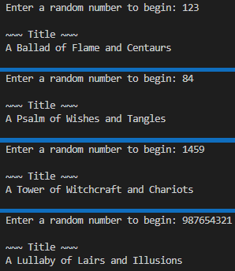

# Young Adult Fantasy Novel Title Generator 
Simple Python program for generating a randomized title for a Young Adult (YA) fantasy novel.

Titles follow the highly popularized ```"A(n) _____ of _____ and _____"``` format.

## Table of Contents
* [General info](#general-info)
* [How to Run](#how-to-run)

## General Info
This program is the product of an idea I had while messing around with Python's built-in ```random``` module. 

After returning to school in Fall 2023, I found myself in one of my local libraries for the first time in over a decade, where I happened to sit down at a desk right next to the Young Adult (YA) book section. As my eyes passed over the spines of a great number of YA fantasy novels, I couldn't help but notice that a healthy portion of them all had one significant commonality: ```"A(n) _____ of _____ and _____"```.

This gave me the idea to pair my interest in random number generation with my interest in data structures, culminating in this program which generates a random seed based off of an initial user input, uses the random seed to select a random number 3 times in a set range, then uses those numbers as indexes to select a random word from within a list associated with either "forms" (e.g., "song," "tale," "city") or "nouns" (e.g., "dragons," "elves," "magic"), which are then used as key-value pairs stored within a data dictionary. 

Once the words are selected, they are appropriately capitalized (as all good titles should be) and then inserted consecutively into the ```"A(n) _____ of _____ and _____"``` format, after which the newly-generated title is both written to a text file called ```title.txt``` and printed to the console for the user to view.



## How to Run
To run this program, simply download the ```YA-fantasy_title-generator.exe``` file under "Releases" and double-click on the file once the download completes.
